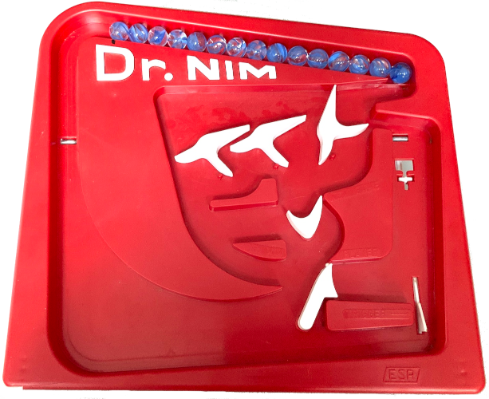

# 2.11BSD-Dr.Nim

The game of Dr. Nim implemented as a CGI application for 2.11 BSD running on the PiDP-11

It was written as a proof-of-concept for an update to the [2.11BSD-httpd](https://github.com/DaveRead/2.11BSD-httpd) web server that forwards request headers to the CGI program via the environment and leaves POST content available via stdin. 

Beyond installing the drnim_webcgi program in the /home/www/cgi-bin directory, the marble.png image is expected to be in the /home/www/images directory.

# Playing the game

On the PiDP11 the URL to access the game is http://PiDP_IP_ADDRESS/cgi-bin/drnim_webcgi

You can force a starting number of marbles (in hex, up to F) and first move (1-3) using a GET request. For example this start the number of marbles at 10 and the player takes 1:

http://PiDP_IP_ADDRESS/cgi-bin/drnim_webcgi?remaining_marbles=A&player_takes=1

## Try it out

If my server is cooperating, you can try the Dr. Nim game: http://semantic.monead.com/cgi-bin/drnim_webcgi

If the PiDP-11 is offline, an Apache server should pick up the slack.
